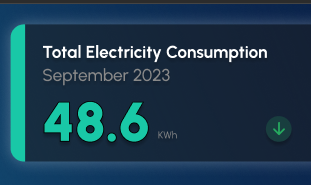

# Live Coding Task

## Description

Read electricity consumption and occupancy data from a mock endpoint and draw a multi line chart using recharts (or something similar).

# Design

1. Have two status cards on top which show the total electricity consumption and total occupancy of the building.
2. A multi line chart showing the occupancy and consumption trend (all time).

## Must have Features

1. Status cards should show only the today's electricity consumption in kWh. Conversion from watts to kWh can be done using `E(kWh) = ( P(W) × T(hrs) ) / 1000`
2. Status cards should also show the today's date and a performance/status icon which shows if the consumption is lower or higher than previous day (compare all date of today with previous data for this). Color of the card and status icon should be reflective of the status/performance.
3. Multi line chart should have two lines, and legend, and anything typical needed for a chart (like a hover tooltip).
4. Line chart should have an option to aggregate the data over 1 hr, 4hrs, and 24 hrs.
5. Line chart should have an option to show/hide individual lines using a dropdown.

## Nice to Have

- Linechart has a full screen or expand icon where the size of the chart increases. Chart should be responsive in this regard.
- Line chart is rendered inside a card component with nice border and shadow.

## Example Design

